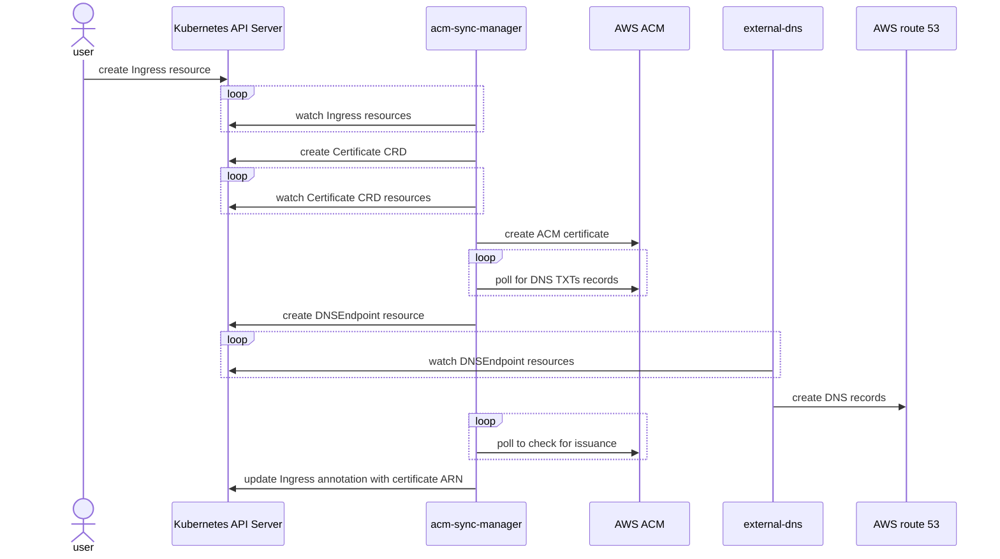

# Introduction

This is a Kubernetes controller that synchronize certificate definitions to
[AWS Certificate Manager](https://aws.amazon.com/certificate-manager/). It also
take care of creating required DNS entries for certificate validation. To create
those DNS entries this controller is using [External-DNS](https://github.com/kubernetes-sigs/external-dns).

This controller manages only ACM public certificates that are going to be used
for [Application Load Balancers](https://aws.amazon.com/elasticloadbalancing/application-load-balancer/)
via an [Ingress resource](https://kubernetes.io/docs/concepts/services-networking/ingress/). For private
certificate the suggested approach is to look at [aws-privateca-issuer](https://github.com/cert-manager/aws-privateca-issuer) and [Cert-Manager](https://cert-manager.io/).

Here are a general sequence diagram of how the manager operates:


# Setup

## Prerequisites

To use this controller you will need to install the External-DNS controller with
the DNSEndpoint CRD installed and configured as a source. See
[crd-source](https://github.com/kubernetes-sigs/external-dns/blob/master/docs/contributing/crd-source.md) for
guidance on how to proceed.

## Configuration
The prefered authentication method is with [IAM roles for Service Accounts](https://docs.aws.amazon.com/eks/latest/userguide/iam-roles-for-service-accounts.html). Alternative authentication methods with this controller are surely possible but not tested at this time.

An example of policy to use that will give required access to ACM:
```json
{
  "Version": "2012-10-17",
  "Statement": [
    {
      "Sid": "acmmanager",
      "Action": [
        "acm:DescribeCertificate",
        "acm:GetCertificate",
        "acm:ListTagsForCertificate",
        "acm:AddTagsToCertificate",
        "acm:RemoveTagsFromCertificate",
        "acm:DeleteCertificate"
      ],
      "Effect": "Allow",
      "Resource": [
        "arn:aws:acm:*:<account_id>:certificate/*"
      ]
    },
    {
      "Sid": "acmmanagerAllResources",
      "Action": [
        "acm:ListCertificates",
        "acm:RequestCertificate"
      ],
      "Effect": "Allow",
      "Resource": [
        "*"
      ]
    }
  ]
}
```

## Installation

To install acm-manager using Helm:

```bash
helm repo add acm-manager https://vdesjardins.github.io/acm-manager
helm install acm-manager/acm-manager --generate-name
```

# Usage
There is two ways you can use this controller: from an Ingress resource or with the Certificate custom resource definition (CRD).

## Ingress resource
This controller watches Ingress resource to create *Certificate* CRD automatically if:
- there is the annotation *acm-manager.io/enable* equals to *yes* or *true*
- OR
- the Ingress field *spec.ingressClassName* equals to *alb* AND *alb.ingress.kubernetes.io/scheme* equals to *internet-facing*. This behavior can be disabled with the startup parameter *ingress-auto-detect*.

Upon creation of the Ingress resource the controller will retreive entries in the *spec.tls* section and provision a Certificate CRD to start the ACM certificate request. *If* the Ingress *spec.tls* section specifies the *secretName* field these hosts will not be added to the ACM certificate request.

When the certificate is provisioned successfuly the *alb.ingress.kubernetes.io/certificate-arn* annotation is set to the ACM certificate ARN on the Ingress ressource.

## Certificate CRD

You can also use the Custom Resource Definition defined by this controller. Here an example:

```
apiVersion: acm-manager.io/v1alpha1
kind: Certificate
metadata:
  name: certificate-sample
spec:
  commonName: endpoint-test.acm-manager.kubestack.io
  subjectAlternativeNames:
    - endpoint-test.acm-manager.kubestack.io
```

# Running e2e tests

These environment variables need to be set:
- AWS_REGION
- AWS_PROFILE
- OIDC_S3_BUCKET_NAME
- TEST_DOMAIN_NAME

## Prepare the AWS environment
```
make setup-aws
```

## Setup the Kind cluster

To create the Kind cluster:
```
make cluster
```

## Run e2e tests

You can now run the E2E tests:
```
make e2etest
```


