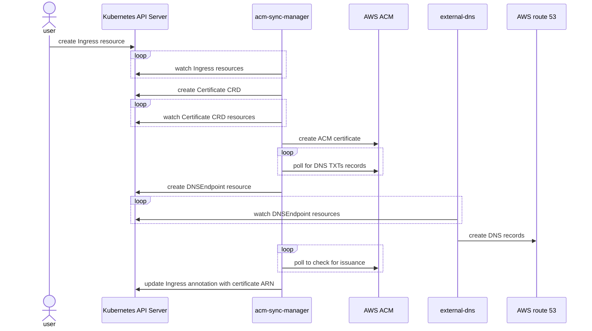

# Introduction

This is a Kubernetes controller that synchronize certificate definitions to
[AWS Certificate Manager](https://aws.amazon.com/certificate-manager/). It also
take care of creating required DNS entries for certificate validation. To create
those DNS entries this controller is using [External-DNS](https://github.com/kubernetes-sigs/external-dns).

This controller manages only ACM public certificates that are going to be used
for [Application Load Balancers](https://aws.amazon.com/elasticloadbalancing/application-load-balancer/)
via an [Ingress resource](https://kubernetes.io/docs/concepts/services-networking/ingress/). For private
certificate the suggested approach is to look at [aws-privateca-issuer](https://github.com/cert-manager/aws-privateca-issuer) and [Cert-Manager](https://cert-manager.io/).

Here are a general sequence diagram of how the manager operates:


# Recent Fixes and Improvements

This fork includes several critical fixes for AWS OIDC authentication and cross-account DNS management:

## 🔧 AWS OIDC Integration Fixes

### External-DNS OIDC Authentication
- **Fixed Missing CRDs**: External-DNS deployment now includes DNSEndpoint CRDs to prevent pod crashes
- **Fixed Namespace Mismatch**: IAM role trust policy corrected to use `system:serviceaccount:default:external-dns` instead of `system:serviceaccount:external-dns:external-dns`
- **Fixed Service Account Annotation**: External-DNS service account properly annotated with IAM role ARN in the `default` namespace
- **Validated OIDC Token Injection**: Confirmed proper AWS environment variables and volume mounts for OIDC authentication

### Certificate Management Improvements
- **Deployment Order Fix**: External-DNS CRDs are now deployed before external-dns manifests in Makefile
- **Rollout Status Validation**: Added deployment readiness checks to ensure external-dns is running before tests
- **Cross-Account DNS Support**: Full support for domain delegation scenarios with different AWS accounts

## 🌐 DNS Delegation Support

### Cross-Account Domain Management
For scenarios where your parent domain (`your-domain.com`) is in one AWS account and you want to test ACM certificates in another account (sandbox), this project now includes:

- **Automated DNS Delegation Script**: `setup-dns-delegation.sh` automates the process of delegating subdomains between AWS accounts
- **Multi-Account Architecture**: Supports testing with domains owned in personal accounts while running tests in sandbox accounts
- **Route53 Integration**: Seamless integration with Route53 hosted zones across multiple AWS accounts

### DNS Delegation Process
```
Personal Account (your-domain.com)
    ↓ (delegates via NS records)
Sandbox Account (acm-test.your-domain.com)
    ↓ (manages DNS validation records)
ACM Certificate Validation ✅
```

## 🚀 Enhanced Testing Experience

### Improved E2E Tests
- **Better Error Handling**: Clear error messages for common setup issues
- **Validation Steps**: Built-in validation for OIDC injection and DNS delegation
- **Status Monitoring**: Real-time certificate and DNS validation status checks
- **Comprehensive Logging**: Detailed logs for troubleshooting authentication and DNS issues

### New Diagnostic Tools
- **DNS Delegation Script**: Interactive script for setting up cross-account DNS delegation
- **OIDC Validation**: Built-in checks for proper AWS authentication injection
- **Certificate Monitoring**: Enhanced status monitoring for ACM certificates and Kubernetes resources

# Setup

## Prerequisites

To use this controller you will need to install the External-DNS controller with
the DNSEndpoint CRD installed and configured as a source. See
[crd-source](https://github.com/kubernetes-sigs/external-dns/blob/master/docs/contributing/crd-source.md) for
guidance on how to proceed.

## AWS Pod Identity Webhook OIDC Configuration

When running ACM Manager in local development or testing environments (such as Kind), proper OIDC configuration is required for the AWS Pod Identity Webhook to function correctly. This allows pods to authenticate with AWS services using IAM roles via web identity tokens.

### Key Requirements

1. **S3 Bucket Configuration**
   - The S3 bucket hosting OIDC files must allow public read access to the JWKS and discovery document
   - Bucket policy must explicitly allow public access to the following paths:
     - `/cluster/acm-cluster/openid/v1/jwks` (original JWKS file)
     - `/cluster/acm-cluster/keys.json` (standard path expected by AWS)
     - `/cluster/acm-cluster/.well-known/openid-configuration` (discovery document)

2. **OIDC Discovery Document**
   - The discovery document must include the following fields:
     ```json
     {
       "issuer": "https://[bucket-name].s3.[region].amazonaws.com/cluster/acm-cluster",
       "jwks_uri": "https://[bucket-name].s3.[region].amazonaws.com/cluster/acm-cluster/keys.json",
       "authorization_endpoint": "urn:kubernetes:programmatic_authorization",
       "response_types_supported": ["id_token"],
       "subject_types_supported": ["public"],
       "id_token_signing_alg_values_supported": ["RS256"],
       "claims_supported": ["sub", "iss"]
     }
     ```
   - The `jwks_uri` must point to the standard `/keys.json` path
   - `authorization_endpoint` and `claims_supported` fields are required by AWS

3. **JWKS File Placement**
   - JWKS file must be placed at both the original path AND at `/keys.json`

4. **MutatingWebhookConfiguration API Version**
   - The MutatingWebhookConfiguration must use `admissionReviewVersions: ["v1beta1"]` to ensure proper pod mutation
   - This is set in the webhook YAML configuration in `e2e/kind_config/install_eks.yaml`
   - Without this setting, the webhook will fail to mutate pods, resulting in authentication errors when pods attempt to use AWS services
   - See issue [aws/amazon-eks-pod-identity-webhook#122](https://github.com/aws/amazon-eks-pod-identity-webhook/issues/122) for details on this requirement

### Automation

The setup process is automated in the Makefile and supporting scripts:

1. `make setup-aws` creates the S3 bucket with appropriate permissions
2. `make setup-eks-webhook` configures the webhook and OIDC files
3. `make cleanup` removes all AWS resources including the S3 bucket

For more details, refer to:
- AWS EKS Pod Identity Webhook documentation: https://github.com/aws/amazon-eks-pod-identity-webhook/blob/master/SELF_HOSTED_SETUP.md
- AWS IAM OIDC Provider documentation: https://docs.aws.amazon.com/IAM/latest/UserGuide/id_roles_providers_create_oidc.html

## Configuration
The prefered authentication method is with [IAM roles for Service Accounts](https://docs.aws.amazon.com/eks/latest/userguide/iam-roles-for-service-accounts.html). Alternative authentication methods with this controller are surely possible but not tested at this time.

An example of policy to use that will give required access to ACM:
```json
{
  "Version": "2012-10-17",
  "Statement": [
    {
      "Sid": "acmmanager",
      "Action": [
        "acm:DescribeCertificate",
        "acm:GetCertificate",
        "acm:ListTagsForCertificate",
        "acm:AddTagsToCertificate",
        "acm:RemoveTagsFromCertificate",
        "acm:DeleteCertificate"
      ],
      "Effect": "Allow",
      "Resource": [
        "arn:aws:acm:*:<account_id>:certificate/*"
      ]
    },
    {
      "Sid": "acmmanagerAllResources",
      "Action": [
        "acm:ListCertificates",
        "acm:RequestCertificate"
      ],
      "Effect": "Allow",
      "Resource": [
        "*"
      ]
    }
  ]
}
```

## Installation

To install acm-manager using Helm:

```bash
helm repo add acm-manager https://vdesjardins.github.io/acm-manager
helm install acm-manager/acm-manager --generate-name
```

# Usage
There is two ways you can use this controller: from an Ingress resource or with the Certificate custom resource definition (CRD).

## Ingress resource
This controller watches Ingress resource to create *Certificate* CRD automatically if:
- there is the annotation *acm-manager.io/enable* equals to *yes* or *true*
- OR
- the Ingress field *spec.ingressClassName* equals to *alb* AND *alb.ingress.kubernetes.io/scheme* equals to *internet-facing*. This behavior can be disabled with the startup parameter *ingress-auto-detect*.

Upon creation of the Ingress resource the controller will retreive entries in the *spec.tls* section and provision a Certificate CRD to start the ACM certificate request. *If* the Ingress *spec.tls* section specifies the *secretName* field these hosts will not be added to the ACM certificate request.

When the certificate is provisioned successfuly the *alb.ingress.kubernetes.io/certificate-arn* annotation is set to the ACM certificate ARN on the Ingress ressource.

## Certificate CRD

You can also use the Custom Resource Definition defined by this controller. Here an example:

```
apiVersion: acm-manager.io/v1alpha1
kind: Certificate
metadata:
  name: certificate-sample
spec:
  commonName: endpoint-test.acm-manager.kubestack.io
  subjectAlternativeNames:
    - endpoint-test.acm-manager.kubestack.io
```

# Development

### Nix Development Environment

This project uses [Nix](https://nixos.org/) to provide a consistent development environment. To get started:

1. Install Nix (if not already installed):
   ```bash
   sh <(curl -L https://nixos.org/nix/install)
   ```

2. Enable Flakes (if not already enabled):
   ```bash
   mkdir -p ~/.config/nix
   echo "experimental-features = nix-command flakes" >> ~/.config/nix/nix.conf
   ```

3. Enter the development shell:
   ```bash
   cd acm-manager
   nix develop
   ```
   
   This will provide all necessary tools like kubectl, kind, helm, and other dependencies.

### Required Environment Variables

For development and local testing, set the following environment variables:

```bash
export AWS_PROFILE="your-aws-profile"
export OIDC_S3_BUCKET_NAME="your-s3-bucket-name"
export AWS_REGION="your-aws-region"
export TEST_DOMAIN_NAME="your-test-domain.com"
export TEST_KUBECONFIG_LOCATION="/tmp/acm_manager_kubeconfig"
```

### Local Development Workflow

1. **Prepare nix environment:**
   ```bash
      direnv allow
   ```
1. **Prepare AWS environment:**
   ```bash
   make setup-aws
   ```

2. **Generate code (required after API changes):**
   ```bash
   make generate
   ```

3. **Set up a local Kind cluster with all components:**
   ```bash
   make cluster
   ```

4. **Run tests:**
   ```bash
   make test
   make e2etest
   ```

5. **Cleanup resources when done:**
   ```bash
   make cleanup
   ```

### Code Generation

When working with the Kubernetes client generators:

1. Code generators are installed via Go using the versions that match the project dependencies
2. Import paths are fixed automatically to handle hyphenated group names (`acm-manager` → `acmmanager`)  
   This is necessary because Go doesn't allow hyphens in package identifiers, but the API group contains a hyphen
3. The `generate` target handles all the necessary steps for client code generation on all platforms (macOS, Linux, and Windows)

# Running e2e tests

These environment variables need to be set:
- AWS_REGION
- AWS_PROFILE
- OIDC_S3_BUCKET_NAME
- TEST_DOMAIN_NAME

## Prerequisites
Export the following environment variables:
```bash
export AWS_PROFILE="your_sandbox_AWS_ROLE" 
export OIDC_S3_BUCKET_NAME="random_and_unique_name" 
export AWS_REGION="ca-central-1"
export TEST_DOMAIN_NAME="your_test_domain.com"
```

## Prepare the AWS environment
```
make setup-aws
```

## Setup DNS Delegation (Required for Cross-Account Testing)

If your test domain is owned in a different AWS account than your sandbox account, you need to set up DNS delegation:

### Prerequisites for DNS Delegation
- Parent domain (e.g., `your-domain.com`) hosted in your personal AWS account
- Subdomain (e.g., `acm-test.your-domain.com`) to be managed by sandbox account  
- AWS CLI profiles configured for both accounts

### Automated DNS Delegation
Use the provided script to automate DNS delegation setup:

```bash
# Make the script executable
chmod +x setup-dns-delegation.sh

# Run with your personal AWS profile
./setup-dns-delegation.sh -p your-personal-aws-profile

# Or run interactively (you'll be prompted for the profile)
./setup-dns-delegation.sh
```

### Manual DNS Delegation (Alternative)
If you prefer manual setup:

1. **Get sandbox account name servers**:
   ```bash
   export AWS_PROFILE="your_sandbox_profile"
   aws route53 get-hosted-zone --id YOUR_SANDBOX_ZONE_ID --query 'DelegationSet.NameServers'
   ```

2. **Create NS records in personal account**:
   ```bash
   export AWS_PROFILE="your_personal_profile"
   aws route53 change-resource-record-sets --hosted-zone-id YOUR_PERSONAL_ZONE_ID --change-batch '{
     "Changes": [{
       "Action": "UPSERT",
       "ResourceRecordSet": {
         "Name": "acm-test.your-domain.com",
         "Type": "NS",
         "TTL": 300,
         "ResourceRecords": [
           {"Value": "ns-xxx.awsdns-xx.net"},
           {"Value": "ns-xxx.awsdns-xx.co.uk"},
           {"Value": "ns-xxx.awsdns-xx.org"},
           {"Value": "ns-xxx.awsdns-xx.com"}
         ]
       }
     }]
   }'
   ```

3. **Verify delegation**:
   ```bash
   # Wait 2-5 minutes for DNS propagation, then test
   dig NS acm-test.your-domain.com
   ```

### DNS Delegation Verification
The script includes built-in verification that checks:
- ✅ NS records are properly created
- ✅ DNS delegation is working
- ✅ Existing certificate validation records are resolvable
- ✅ Certificate status monitoring

## Setup the Kind cluster

To create the Kind cluster:
```
make cluster
```

## Run e2e tests

You can now run the E2E tests:
```
make e2etest
```

## Troubleshooting

### Common Issues and Solutions

#### 1. External-DNS Pod Crashes with "DNSEndpoint CRD not found"
**Problem**: External-DNS pod crashes because DNSEndpoint CRDs are missing.

**Solution**: The Makefile has been updated to deploy CRDs first:
```bash
make deploy-external-dns  # Now includes CRD deployment
```

#### 2. AWS Access Denied Errors for External-DNS
**Problem**: External-DNS can't authenticate with AWS (AssumeRoleWithWebIdentity errors).

**Root Cause**: IAM role trust policy has incorrect namespace in the subject condition.

**Solution**: Verify the trust policy uses `system:serviceaccount:default:external-dns`:
```bash
# Check current trust policy
aws iam get-role --role-name external-dns-role --query 'Role.AssumeRolePolicyDocument'

# Update if needed - the policy should reference 'default' namespace
```

#### 3. Certificate Validation Stuck in "PendingValidation"
**Problem**: ACM certificates never complete DNS validation.

**Root Cause**: DNS delegation not configured for cross-account scenarios.

**Solution**: 
1. Run the DNS delegation script:
   ```bash
   ./setup-dns-delegation.sh -p your-personal-aws-profile
   ```
2. Verify delegation is working:
   ```bash
   dig NS acm-test.your-domain.com
   ```

#### 4. DNS Validation Records Not Resolvable
**Problem**: Certificate validation records exist in Route53 but aren't globally resolvable.

**Diagnosis**: 
```bash
# Test direct query to sandbox name servers
dig _validation_record.test1.acm-test.your-domain.com CNAME @ns-xxx.awsdns-xx.net

# Test global resolution
dig _validation_record.test1.acm-test.your-domain.com CNAME @8.8.8.8
```

**Solution**: Wait for DNS propagation (2-48 hours) or check delegation setup.

#### 5. Certificate Controller "not found" Errors
**Problem**: Controller logs show "Certificate not found" errors after test completion.

**Root Cause**: Harmless - controller work queue has leftover entries for deleted certificates.

**Solution**: These errors will stop appearing as the work queue clears (no action needed).

### Monitoring Commands

#### Check Certificate Status
```bash
# Kubernetes certificate status
export TEST_KUBECONFIG_LOCATION="/tmp/acm_manager_kubeconfig"
kubectl get certificates --all-namespaces --kubeconfig=$TEST_KUBECONFIG_LOCATION

# ACM certificate status  
export AWS_PROFILE="your_sandbox_profile"
aws acm list-certificates --query 'CertificateSummaryList[*].[CertificateArn,Status]'
```

#### Verify OIDC Injection
```bash
# Check external-dns pod environment
kubectl describe pod -l app.kubernetes.io/name=external-dns --kubeconfig=$TEST_KUBECONFIG_LOCATION

# Look for:
# - AWS_ROLE_ARN environment variable
# - AWS_WEB_IDENTITY_TOKEN_FILE environment variable  
# - Projected service account token volume mount
```

#### DNS Delegation Status
```bash
# Verify NS delegation
dig NS acm-test.your-domain.com

# Test validation record resolution
dig _validation_hash.test1.acm-test.your-domain.com CNAME
```

## To clean up local environment
```
make cleanup-aws  # cleanup the AWS environment
make cleanup      # cleanup the Kind cluster
